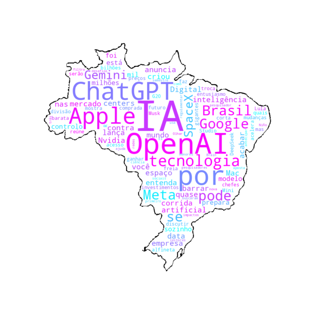

# Inteligência de Mercado: Radar Analítico de Notícias com IA Generativa
Solução de inteligência de dados desenvolvida para monitorar e quantificar a percepção da mídia corporativa em tempo real. O pipeline utiliza Modelos de Linguagem (LLM) e Processamento de Linguagem Natural (NLP) para transformar dados não estruturados de notícias em análises de sentimento e tendências de mercado. 

*Figura 1: Representação visual (WordCloud) georreferenciada evidenciando os termos de maior relevância e tração nas manchetes recentes.*

## Objetivo do Projeto
Monitorar e quantificar a percepção da mídia brasileira em relação ao avanço da Inteligência Artificial. O projeto coleta notícias recentes, filtra termos estratégicos de mercado (ex.: *Nvidia, Google, OpenAI, Brasil*), classifica o tom contextual via LLM e gera saídas tabulares e visuais de suporte à decisão.

## Tecnologias e Bibliotecas Utilizadas
- Linguagem e Ambiente: Python 3, Google Colab
- APIs Externas: NewsAPI, Google Gemini API 
- Manipulação de Dados: pandas, numpy
- SDK de Inteligência Artificial: google-genai, google-generativeai
- Visualização e NLP: wordcloud, matplotlib, Pillow (PIL)
- Integração e Sistema: requests, time

## Principais Resultados Obtidos
- Tratamento de Exceções em Lote: Implementação de controle de fluxo de chamadas para evitar interrupções operacionais durante o processamento de grandes volumes de requisições.
- Pipeline Estruturado: Geração de base de dados final limpa e pronta para ser consumida por ferramentas de Business Intelligence.
- Análise Visual Georreferenciada: Identificação dos termos de maior tração na imprensa nacional mapeados geometricamente, facilitando o consumo imediato por áreas de negócios.

## Como Executar o Projeto
1. Clone o repositório em sua máquina local.
2. Instale as dependências via terminal utilizando: pip install google-genai pandas requests wordcloud matplotlib pillow numpy
3. Configure as credenciais de acesso (GEMINI_API_KEY e NEWS_API_KEY) em seu ambiente ou nos Secrets do Google Colab.
4. Execute as células do notebook sequencialmente para extrair as notícias, gerar o relatório tabular e a visualização gráfica.

Amostra de Relatório Gerado
### 📰 Exemplo de Notícias Analisadas:
- [Como a inteligência artificial foi “descoberta”: a história real](https://olhardigital.com.br/2026/08/26/inteligencia-artificial/como-a-inteligencia-artificial-foi-descoberta-a-historia-real/) - **Sentimento: Positivo**
- [Por que a inteligência artificial importa? Entenda de forma simples](https://olhardigital.com.br/2026/08/27/inteligencia-artificial/por-que-a-inteligencia-artificial-importa-entenda-de-forma-simples/) - **Sentimento: Positivo**
